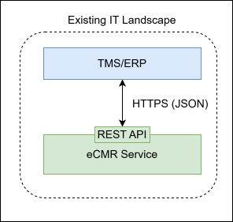
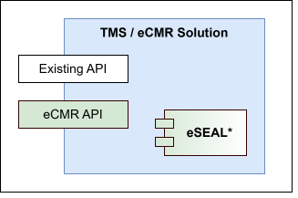
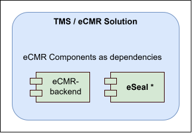

[[section-deployment-view]]
== Deployment View
The eCMR is designed to integrate smoothly into existing IT Systems and supports three clearly defined integration
approaches. All three options allow organizations to reuse existing systems and processes while ensuring legal compliance and interoperability.

All integration approaches support incremental adoption and coexistence with existing IT systems. Organizations may
start with one approach and evolve towards the other as architectural requirements or business needs change.

=== Integrate the eCMR Service into your IT Landscape

The first integration option is to integrate the eCMR Service into an existing IT landscape. In this scenario, the eCMR
is consumed as an external service and accessed via standardized interfaces.

Existing IT systems (e.g. TMS or other logistics platforms) interact with the eCMR Service to create, update, exchange, and retrieve eCMR documents, while core eCMR functionality is handled by the service itself.

An example setup can be found in the https://git.openlogisticsfoundation.org/wg-electronictransportdocuments/ecmr/ecmr-backend/-/blob/cf6cf3e645c7e8b3227409bf4e06e223218585a1/docker-compose.yml[docker-compose.yml]

==== Prerequisites for Quick Onboarding

====
. Supported SQL database (Microsoft SQL Server or PostgreSQL)
. OAuth2-compatible identity provider (e.g., Active Directory, Keycloak)
. Access to OLF eCMR repositories https://git.openlogisticsfoundation.org/wg-electronictransportdocuments/ecmr[ecmr-backend, ecmr-frontend]
. Existing IT system(s) for potential integration (e.g., TMS)
. Network and infrastructure to host backend and frontend components
====

Required eCMR Components::

ecmr-backend:::
The eCMR backend provides the core eCMR functionality and includes:
* The standardized eCMR data model
* *eSEAL* component as dependency
* APIs for managing the eCMR lifecycle, eCMR exchange and integration with external IT systems (e.g. TMS, ERP or
other custom logistics or eCMR services)

ecmr-frontend:::
The eCMR frontend provides user-facing functionality (e.g. for drivers, dispatchers, or operators).
The frontend can be:
* Adapted to a company-specific design system or style guide, or
* Replaced entirely by a custom frontend implementation, as long as it consumes the APIs exposed by the eCMR backend

Required Infrastructure Components::

In addition to the eCMR components, the following infrastructure is required:

SQL Database Management System:::
A relational database is required for persisting eCMR data and process state.
The eCMR backend has been tested with:
* Microsoft SQL Server
* PostgreSQL

OAuth2-compatible Identity and User Management:::
User authentication and authorization are handled via an OAuth2-compatible identity provider, such as:
* Active Directory
* Keycloak
Existing enterprise identity solutions can be reused and integrated with the eCMR backend.

==== Repository-Level Integration

From a repository perspective, this integration typically involves:

* Deploying the eCMR backend repository, including its dependencies (data model and eSEAL components)
* Deploying and customizing the eCMR frontend repository, or implementing a custom frontend against the backend APIs
* Connecting the backend to a supported SQL database system
* Integrating an existing OAuth2 identity provider for user and role management
* Integrating existing IT systems (e.g. TMS) with the eCMR backend via its APIs

*This option offers*

This option provides a complete, production-ready eCMR setup with flexibility in deployment, branding, and system
 integration.

==== Setting up the eCMR Service

This guide provides a clear, step-by-step approach for setting up the eCMR backend and frontend.

===== Define the Target Setup

Before installing the service, clarify how it will be used:

* The backend runs as an independent service, handling eCMR lifecycle and ecmr storage.
* The frontend provides a user interface for drivers, dispatchers, and operators.
* Existing IT systems interact with the backend via REST APIs.
* Authentication and authorization are handled via OAuth2.

Defining the target setup ensures the installation is aligned with your IT architecture.

===== Prepare the Prerequisites

To run the eCMR service, the following components are required:

* Docker (for deploying both backend and frontend containers)
* A SQL database (like PostgreSQL or Microsoft SQL Server)
* An OAuth2 identity provider (Keycloak or Active Directory)
* Access to the Open Logistics Foundation eCMR repositories (backend, frontend, eSEAL components)
* Network and infrastructure to host backend and frontend components

Docker ensures consistent deployment, simplifies dependencies, and allows easy scaling.

===== Download the eCMR Components

Clone (or Download) the OLF eCMR repositories::

Backend repository:::
Includes the eCMR data model, eSEAL component, and APIs.

Frontend repository:::
Provides a web-based interface for interacting with eCMRs.

The frontend can either be::
* Adapted to your company’s style guide, or
* Replaced entirely by a custom frontend as long as it communicates with the backend API.

===== Set up the Database

. Create a dedicated database and user for the backend.
. Configure the backend with connection parameters (JDBC URL, username, password). See <<backend-configuration>> for
detailed configuration.
. Verify connectivity and permissions between the backend and the database.

===== Configure Authentication and Authorization

* Set up an OAuth2 provider like keycloak. You can use an existing one as well.
* Register the backend service as a client. if required by your identify provider.
* Define roles and scopes for users and services.
* Configure the backend to trust the identity provider. See <<backend-configuration-usermanagement>> for
detailed configuration.
* Verify access by calling a protected API endpoint using a valid token.

===== Configure eSEAL and Digital Signatures

* Configure a key pair, keystores, and signature settings. See <<eseal-configuration>> for detailed configuration.
* Verify that the backend can generate and validate eSEALs.
* Ensure signature metadata is correctly stored with each eCMR document.
* Hint: If no external eSEAL solution exists, the provided eSEAL component can be used directly.

===== Configure the Frontend
The eCMR frontend provides the user interface for interacting with eCMRs. It is designed to run as a Docker container alongside the backend.

* The frontend can be used as-is, providing a complete interface for drivers, dispatchers, or operators.
* It can be customized to your company’s style guide, including branding, colors, and layout.
* Alternatively, a custom frontend can be implemented, as long as it communicates with the backend API.
* Configure the frontend with the backend service URL and authentication settings to ensure proper connectivity. See
<<frontend-configuration>> for more information.
* Verify that users can access the frontend and perform key operations such as creating, viewing, and managing eCMRs.

Both the backend and frontend run in Docker containers, making deployment, scaling, and updates consistent and straightforward.

===== Build and Deploy the Service

. Build the backend and frontend components using the provided tooling.
. Deploy the backend and frontend to your environment.
. Ensure network connectivity between:
** Backend and database
** Backend and identity provider
** Frontend and backend
** Any integrated IT systems (e.g., TMS)

===== Verify APIs and Frontend Functionality

* Use the OpenAPI definition to explore and test the backend endpoints.
* Test creating, updating, and retrieving eCMR documents.
* Test eSEAL generation and signature verification.
* Ensure the frontend can access and display backend data correctly.

****
Note: These steps are guidance and best-practice recommendations. The exact verification process may vary depending on your specific IT landscape, deployment environment, and internal IT compliance requirements.
****

===== Integrate with Existing IT Systems

* Configure TMS, ERP, or other systems to consume backend APIs.
* Implement API calls for creating eCMRs, updating transport events, retrieving document states, and triggering signatures.

****
Note: Integration steps are provided as practical guidance. Implementation details may vary depending on your IT environment, architecture, and internal compliance policies.
****

=== Implement the eCMR API in your existing IT System

As a second option, organizations can implement the eCMR API directly in their existing IT systems (e.g. TMS or
another eCMR-enabled service).

The eCMR API is defined in the provided https://git.openlogisticsfoundation.org/wg-electronictransportdocuments/ecmr/ecmr-backend/-/blob/0a1cbe99836af26ce754fdb273f45cc90f193246/openapi.yml[openapi.yml] file and enables:

- Creation and management of eCMR documents
- Exchange of eCMRs between involved parties
- Retrieval of document status and signed versions

*Important:*
A prerequisite for this integration option is the availability of an eSEAL solution within the existing system.
If no eSEAL implementation is available, the https://git.openlogisticsfoundation.org/wg-electronictransportdocuments/ecmr/eseal[eSEAL component] provided by the Open Logistics Foundation (OLF) can
be used.

==== Prerequisites for Quick Onboarding
====
* Access to the https://git.openlogisticsfoundation.org/wg-electronictransportdocuments/ecmr/ecmr-backend/-/blob/0a1cbe99836af26ce754fdb273f45cc90f193246/openapi.yml[openapi.yml] file defining the eCMR API
* Existing IT system(s) where the API will be implemented (e.g., TMS)
* An eSeal implementation *or* access to the OLF https://git.openlogisticsfoundation.org/wg-electronictransportdocuments/ecmr/eseal/-/tree/f9c311bc928619073d2f7f3baff60840aeb50a48/[eSeal component]
====

=== Integrate  eCMR components into your existing IT System *(not in focus)*

Integration by embedding eCMR components (e.g. data model, backend services, eSEAL, optional frontend) into existing IT systems is conceptually possible.

However, this integration variant is currently not explicitly supported by dedicated implementations or reference architectures. As a result, it is not described in detail in the current documentation and is planned for future development.

=== How to establish sharing eCMR

Overview, architecture and workflow sharing eCMRs between instances

