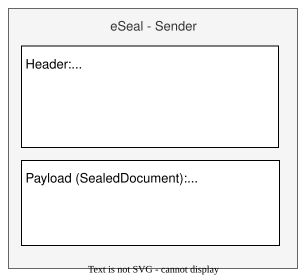
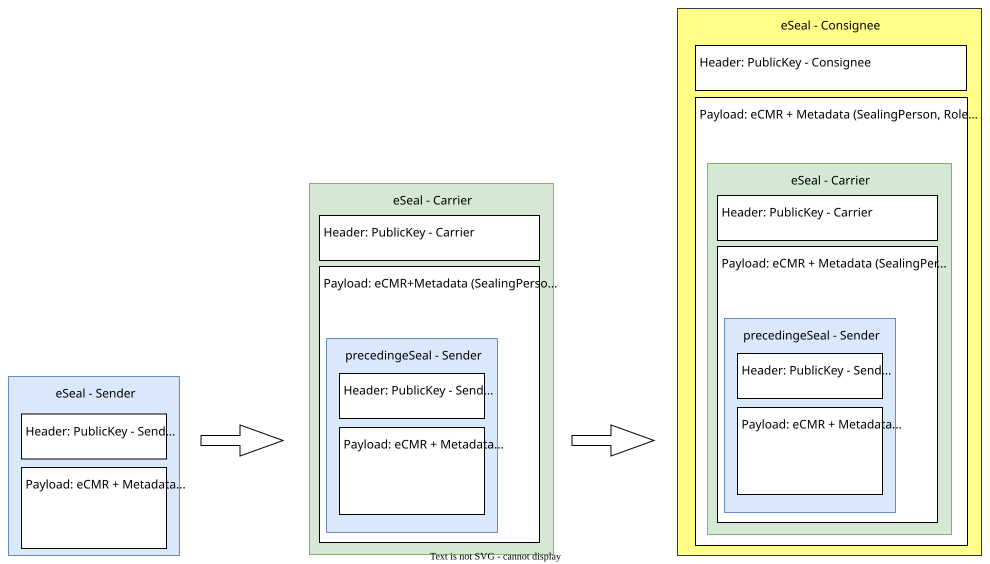
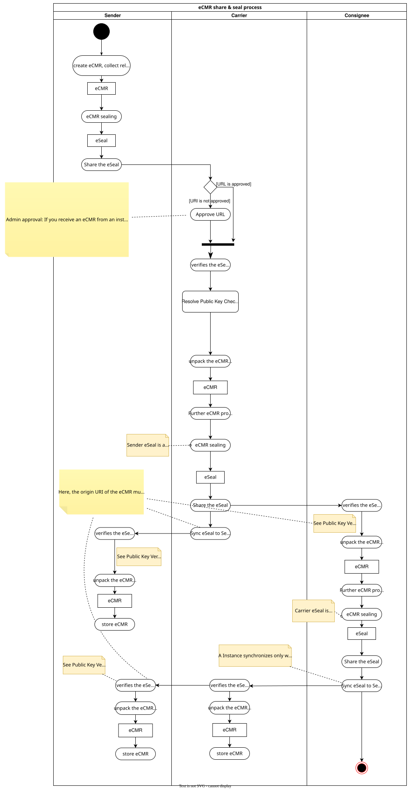

[[section-concepts]]

=== Domain Model

See https://git.openlogisticsfoundation.org/wg-electronictransportdocuments/ecmr/ecmr-model[eCMR data model] for
more information about the eCMR domain model

=== eCMR sharing process and eSeal implications

==== Core Concept

- Partners exchange _only_ eSeals, never raw eCMRs.
- By validating the latest eSeal, the full history of the eCMR can be reconstructed via the chain of precedingSeals.
- Simplified communication: the eSeal is the canonical transferable unit.
- The public key for eSeal verification is part of the eSeal Header. To verify the public key, a checksum is published via an DNS record of the providing eCMR instance.

==== Result

This creates a chain of eSeals, ensuring a full audit trail of all eCMR changes.

==== eSeal concept

The eSeal (header + payload) is generated with the sealer's private key.

* With the public key from the header (part of the x5c chain of X.509 certificates), every participant can verify the authenticity and integrity of the seal and its header and payload.

===== eSeal structure

**Header**

*.* Contains metadata and signature details (algorithm, certificate information, key ID, etc.).

**Payload**

The sealed JSON document, in our case the eCMR.

* This contains the complete eCMR data record.
* Since the payload (and the header) is sealed, any modification is immediately detectable, as the integrity of the
entire seal would be broken.

===== Chain of Seals

The next diagram shows the eCMR chain of seals evolving from the sender to the consignee.

==== eSeal Verification

. eSeal header contains the public key

. DNS entry provides checksum for the public key

When an eSeal is created, the public key of the signing instance is embedded in the header of the eSeal.

The owner of the public key (i.e. the instance operator) publishes a checksum (hash) of the key in a DNS record under a domain it controls.
The resolver of the seal verifies that the public key in the eSeal header, when hashed with SHA-256, matches the value in the DNS record.
This way, the authenticity of the public key is anchored in DNS, which is already a trust infrastructure.

==== The ecmr sharing process

eCMR Sharing as an activity diagram:

==== eSeal example

Goto https://www.jwt.io/, open the example below and copy the text to the JWT input area on the left side.
Now, you  can see header and payload of the eseal on the right side.

link:images/example_seal.jwt["example"]
